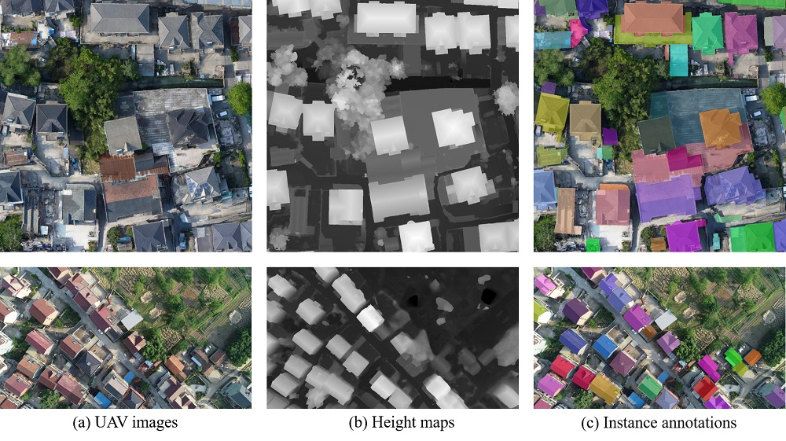

Introducation
======
The dataset, called **InstanceBuilding**, contains building instance annotation for both 3D urban scenes and UAV images simultaneously, which makes it unique. We annotated 16 thousand roofs for 608 UAV images, all of which are enhanced with corresponding height maps. We also annotated 892 roofs/buildings for 3D urban scenes, among which more than 600 buildings are attached to others. In such crowded urban scenes, instance segmentation has a more significant advantage over semantic segmentation in various applications. Comparisons with existing datasets can be found in our [IEEE TGRS paper](https://californiachen.github.io/publications/2022TGRS/).

2D annotation
======
We annotated 608 drone images with high resolutions for roofs. They are selected from around 20 thousand drone images acquired in more than 10 different cities by a consumer DJI drone Phantom 4 Pro with different cameras and flight altitudes. There are about 16 thousand buildings in all these images, and their roofs are all manually annotated for the training of our 2D roof instance segmentation neural network. A height map is generated for each UAV image, it is used to facilitate the 2D annotation, and improve the learning-based roof instance segmentation as well.

  
Figure 1: Two examples of 2D annoatation for building instances for UAV RGB images and height maps.

3D annotation
======
We annotated 4 3D scenes for both roofs and entir buildings,  which are reconstructed using Bentley Acute3D ContextCapture from thousands of UAV images. Two have textures, while the other two do not have. To facilitate the 3D annotation, we have developed a simple but efficient brush-based annotation tool. Similar to most 2D annotation tools which semi-automatically extract pixels of an object by marking the closed boundary polygon of the object, our tool allows a user to segment a 3D building by casually drawing strokes on the building boundaries. 

* Scene1 (roofs on the left, buildings on the right):

* Scene2:

* Scene3:

* Scene4:

Potential uses:
=====
- Roof instance segmentation for UAV images (experimented in our IEEE TGRS work);
- 3D building instance segmetation for 3D urban scenes (experimented in our IEEE TGRS work);
- 3D building simplification for for 3D urban scenes;
- Height estimation for UAV images or remote-sensing images;
- Reconstruction of 3D ubran scenes;
- ...

Download:
======
Google Driver: [https://drive.google.com/drive/folders/1cxsq5FT8JkqGv6EFp3zjNw1HqNLjtAOo](https://drive.google.com/drive/folders/1cxsq5FT8JkqGv6EFp3zjNw1HqNLjtAOo)

Baidu Cloud: [https://pan.baidu.com/s/1zvR7C_ZfcHiRJTJAKzlHFQ](https://pan.baidu.com/s/1zvR7C_ZfcHiRJTJAKzlHFQ) (ka29)

Citation:
======
Jiazhou Chen, Yanghui Xu, Shufang Lu, Ronghua Liang*, Liangliang Nan. &quot; 3D Instance Segmentation of MVS Buildings.&quot; <i>IEEE Transactions on Geoscience and Remote Sensing</i>. 2022, doi: 10.1109/TGRS.2022.3183567. <a href="{{ '../files/2022TGRS/ref.txt' }}"> {{'BibTex'}}</a>
