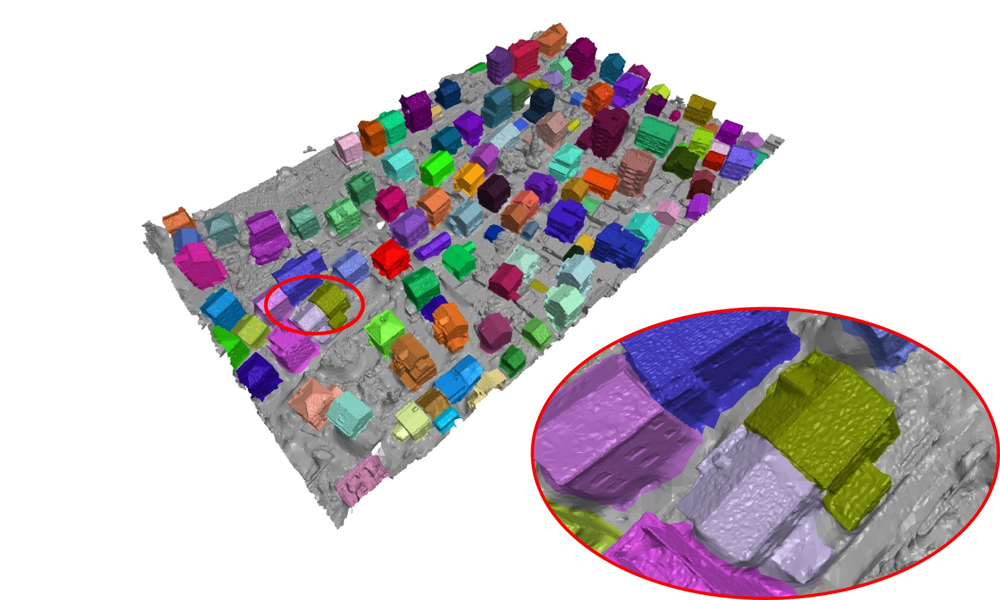
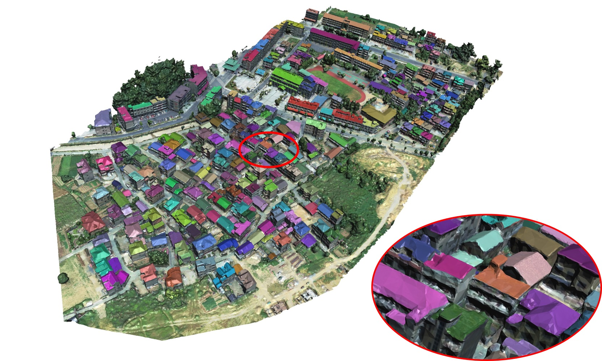
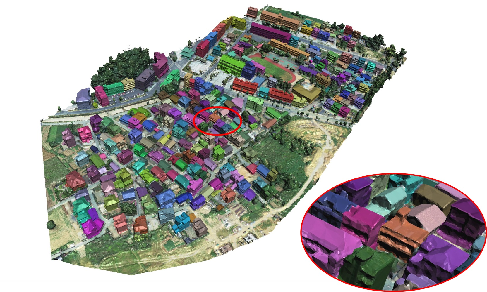

A benchmark dataset for instance segmentation of 3D buildings in large urban scenes. The dataset consists of both roof instances in RGBH images and building instances in 3D mesh models.

Introducation
======
This dataset contains building instance annotation for both 3D urban scenes and UAV images simultaneously, which makes it unique. This dataset also contains 608 annotated UAV images with high resolutions. They are selected from around 20 thousand drone images acquired in more than 10 different cities by a consumer DJI drone Phantom 4 Pro with different cameras and flight altitudes. There are about 16 thousand buildings in all these images, and their roofs are all manually annotated for the training of our 2D roof instance segmentation neural network. These annotated images are divided into 2 groups, 524 images for training and 84 images for validation. To facilitate the 3D annotation, we have developed a simple but efficient brush-based annotation tool. Similar to most 2D annotation tools which semi-automatically extract pixels of an object by marking the closed boundary polygon of the object, our tool allows a user to segment a 3D building by casually drawing strokes on the building boundaries. Note that the town is quite crowded, thus about 2/3 buildings are attached to others. The 

2D dataset
======
We annotated 608 drone images for roofs, which are divided into 2 groups, 524 images for training and 84 images for testing.

3D dataset
======
We annotated 4 scenes for both roofs and entir buildings.

* Scene1:

* Scene2:

* Scene3:

* Scene4:

Download:
======
Google Driver:  

Baidu Cloud: https://pan.baidu.com/s/161n4MbaZWDfhMvMhcPedlw
