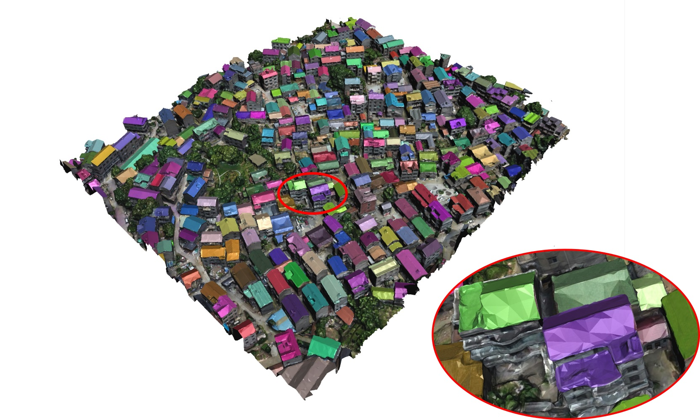

Introducation
======
The dataset, called **InstanceBuilding**, contains building instance annotation for both 3D urban scenes and UAV images simultaneously, which makes it unique. About 16 thousand roofs in UAV images are annotated, and 892 roofs/buildings in 3D urban scenes are annotated. Among these 892 buildings, more than 600 buildings are attached to others. In such crowded urban scenes, instance segmentation has a more significant advantage over semantic segmentation in various applications. Comparisons with existing datasets can be found in our [IEEE TGRS paper](https://californiachen.github.io/publications/2022TGRS/).

2D annotation
======
We annotated 608 drone images with high resolutions for roofs. They are selected from around 20 thousand drone images acquired in more than 10 different cities by a consumer DJI drone Phantom 4 Pro with different cameras and flight altitudes. There are about 16 thousand buildings in all these images, and their roofs are all manually annotated for the training of our 2D roof instance segmentation neural network.

 

Figure 1: Four examples of 2D annotated images.

3D annotation
======
We annotated 4 3D scenes for both roofs and entir buildings,  which are reconstructed using Bentley Acute3D ContextCapture from thousands of UAV images. To facilitate the 3D annotation, we have developed a simple but efficient brush-based annotation tool. Similar to most 2D annotation tools which semi-automatically extract pixels of an object by marking the closed boundary polygon of the object, our tool allows a user to segment a 3D building by casually drawing strokes on the building boundaries. 

* Scene1 (roofs on the left, buildings on the right):

* Scene2:

* Scene3:

* Scene4:

Download:
======
Google Driver:  

Baidu Cloud: https://pan.baidu.com/s/161n4MbaZWDfhMvMhcPedlw

Citation:
======
